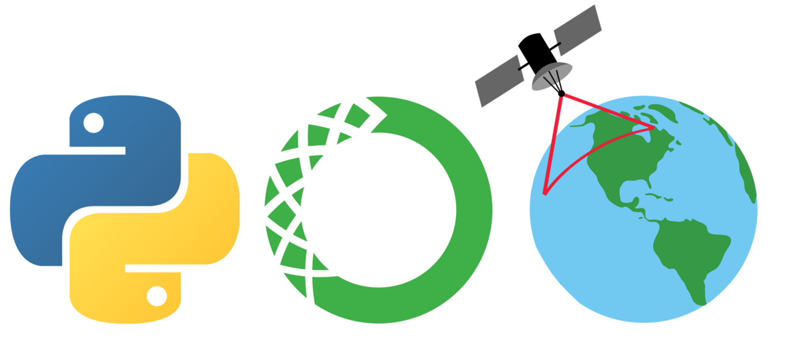

# GeoSpace: Anaconda environment for the earth's observations 

<p align="center">
  
</p>

# Library needed before the main Anaconda installation

The GeoSpace environment and especially some tool's functionalities require the installation of the [CDO library](https://code.mpimet.mpg.de/projects/cdo/) (Climate Data Operators) which can be installed with the instructons given below. Overall it is not strictly necessary because the opration involved (to be more precise concerning the netcdf4 data splitting/merging and grib conversion). I just decide to add such library because I find it very intuitive and easy to use. Anyway,I am planning to create my own pythom module to archive the same results of the CDO library some time soon)

**- For MacOS:**

You can use homebrew, please check the extensive documentation under "https://brew.sh". After successful installation, CDO can be installed as easy as:

  ```
  brew install cdo
  ```

  **- For Linux:**
  
  You can use the native package manager of Linux Ubuntu as follow:

  ```
  sudo apt-get install cdo
  ```

  **- For Window:**

  Install CDO is not very user friendly.. from the ufficial project [WEB-PAGE](https://code.mpimet.mpg.de/projects/cdo/wiki/Win32) you can retrive more info about.

# Anaconda environment installation

Once you installled CDO or not, Please to download the environment.yml file relative to your operating system [HERE](https://anaconda.org/CSammarco/GeoSpace/files) called "GeoSpace.yml" and run:

```
conda env create -f GeoSpace.yml
```

To activate the evironment run:

```
conda activate GeoSpace
```

**I did not include the file for the Window OS because at the moment i did not find a user friendly recipe. However, If you want to have a try please to do as follow (It is just a workaround and not sure if working with all of you):**

```
conda create --name GeoSpace  python=3.8
conda activate GeoSpace
conda install -c conda-forge gmt 
```

After that follow the instructon about the installation in windows of the [MerOC python package](https://github.com/carmelosammarco/MerOC). Once done with it please to run:

```
pip install tool4NC MerOC FTPsubsetMO ads4MO GPSconverter
```

At this point your environment should be functional an ready!

One you are done with the creation of the environment, you will  have all the main python modules used for the earth observation (the most used at least, but free to add more yourself once you created the GeoSpace environment to be tailored to your needs), plus more important some  python tools  developed by me that I hope will semplify many of yours operations and procedures listed below (I will describe brefly each one here but I kindly suggest you to to visit the [LINK] for more detailed information):

**- Tool4NC** : A python module for the netcdf file manipulation and conversions.[LINK](https://github.com/carmelosammarco/Tool4NC)

**- MerOC** : A Python module (with a GUI interface) to download data and manipulate/convert netCDF-files.[LINK](https://github.com/carmelosammarco/MerOC)

**- ads4MO** : A Python module which adds new downloads services to the CMEMS portal (by Copernicus - registration to the portal required to download the data). It is applied mainly to big data requests using just a CLI and the HTTP data requests.[LINK](https://github.com/carmelosammarco/ads4MO)

**- FTPsubsetMO** : Python module to download file from the CMEMS FTP servers (by Copernicus - registration to the portal required to download the data) and automatically subset them using many decisional criteria. It is applied mainly to big data requests of product with an elevated number of data requests and where then the HTTP protocol fail. It has a very intuitive GUI interface.[LINK](https://github.com/carmelosammarco/FTPsubsetMO)

**- GPSconverter** : Python application to manipulate & view/plot GPS data.[LINK](https://github.com/carmelosammarco/GPSconverter)

**Periodically I suggest you to run  the following command, inside the GeoSpace environment, to have always the last version avaiable of modules and tools described above:**

```
conda update --all
```

# Disclaimer:

My developed tools included in this environment and listed above are result of personal intellectual work and development, so as such I will not be held responsible for any use you make of it, nor for the results and conclusions you may find using them. Also Although I have cross-checked the whole code, I cannot warranty it is exempt of bugs. 

Please also to remember to cite them  if they help for research or jobs activities and let me know!. 

Feedbacks ara well accepted of course

Enjoy! :)
